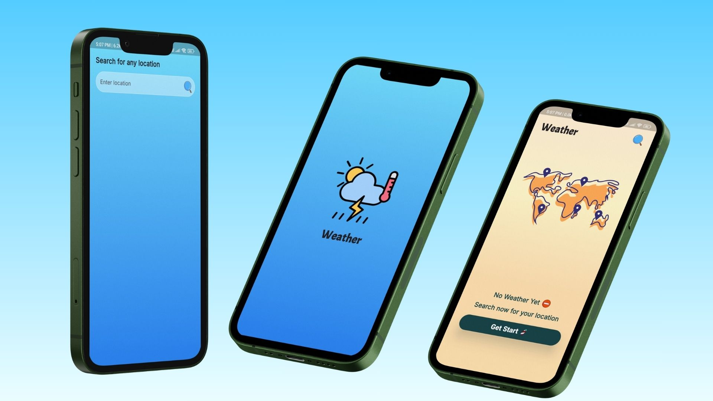
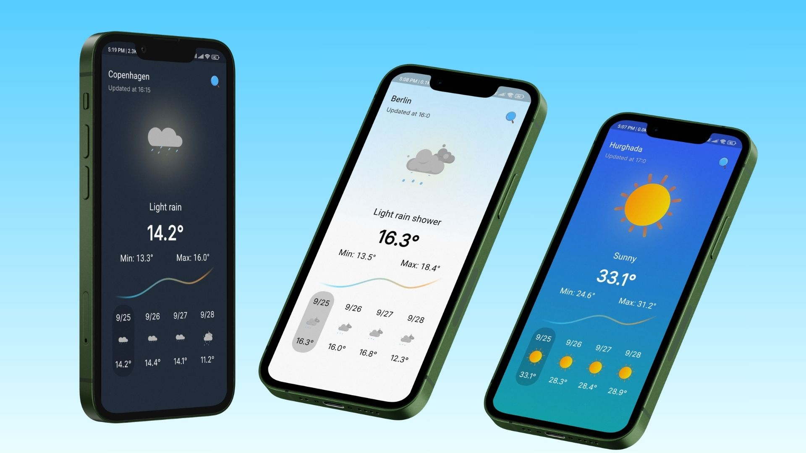
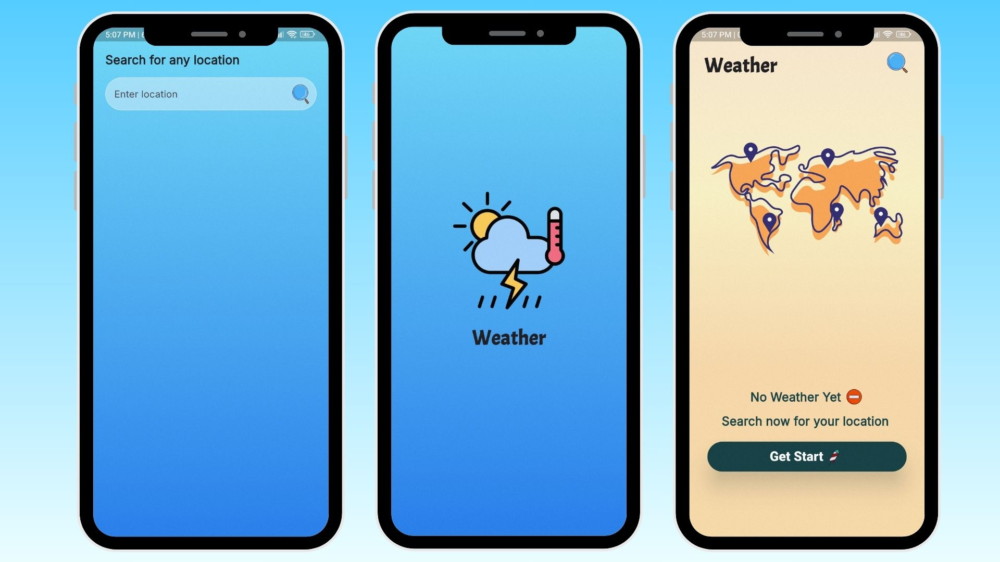
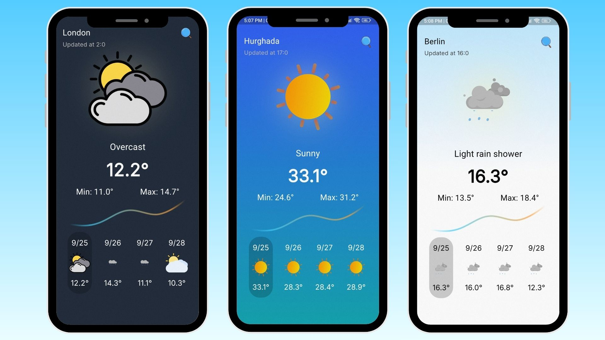

<div align="center">
  <h1>🌤️ Weather App</h1>
</div>

Welcome to the **Weather App**, a Flutter-based mobile application that provides real-time weather updates and a 3-day forecast with a visually appealing and animated interface.

## 📱 Features
- **Real-time Weather Data**: Fetches current weather conditions  using the Weather API.
- **3-day Forecast Weather Data**: Fetches 3-day forecast using the Weather API.
- **Intuitive Search**: Users can search for weather by location, with easy navigation from the splash screen to the search page.
- **Beautiful Animations**: Includes smooth animations and JSON/GIF images using Lottie for a more engaging user experience.
- **Loading Animation**: Aesthetic loading animations provide feedback while fetching weather data.

-----


## 📸 Screenshots
 Image 1 | Image 2 |
|---------|---------|
|  |  |

 Image 3 | Image 4 |
|---------|---------|
|  |  |

-----

## 🛠️ Technologies & Tools

The app is built using the following technologies:

- **Flutter:** The core framework for building UIs.
- **Bloc/Cubit:** For efficient state management using unidirectional data flow.
- **MVVM:** Architectural pattern for separation of concerns, ensuring maintainable code.
- **Weather API**: Fetching real-time weather data.

----

### Key Packages

- **[Http](https://pub.dev/packages/http):** A powerful and flexible HTTP client for making API requests.
- **[Go_Router](https://pub.dev/packages/go_router):** Manages app routing with ease and efficiency.
- **[Equatable](https://pub.dev/packages/equatable):** Simplifies object equality comparisons, crucial for effective state management.
- **[Lottie](https://pub.dev/packages/lottie):** Efficient image loading and caching for enhanced performance.

-----

## 📂 Project Structure

The app follows MVVM design pattern to ensure scalability and maintainability:

- `lib/`
  - `data/` - Contains API services and data models.
  - `logic/` - Bloc Cubit files for state management.
  - `presentation/` - All UI screens and widgets.
  - `core/` - Common utilities, theme, and weather service.

-------

## ⚙️ Installation Guide

To set up the BookNest application locally, follow these steps:
1. Clone the repository:
   ```bash
   git clone https://github.com/MarkMagdyShawky/weather_app.git
2. Navigate to the project directory:
   ```bash
   cd weather_app
3. Fetch the project dependencies:
   ```bash
   flutter pub get
4. Run the application:
   ```bash
   flutter run

-----

## 🛡️ License
This project is licensed under the MIT License – see the [LICENSE](LICENSE) file for details.

-----

## 👤 Author

This project was designed and developed entirely by ***[Mark Magdy Shawky]***.

For any inquiries, feel free to reach out:

- **Email:** [markmarkmagdy1010@gmail.com](mailto:markmarkmagdy@gmail.com)
- **LinkedIn:** [mark-magdy-02600923](www.linkedin.com/in/mark-magdy-026009236)
